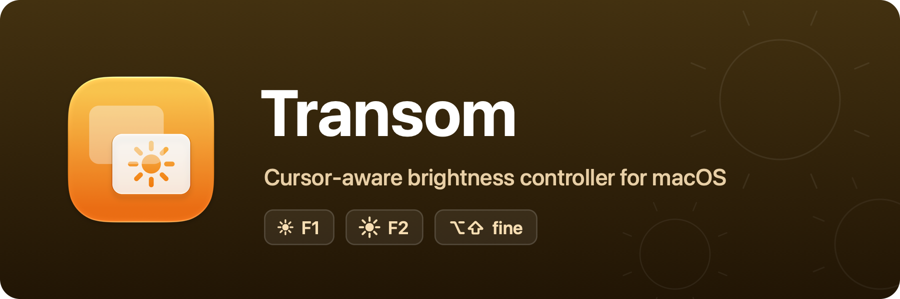

<p align="center">
  
</p>

<p align="center">
  A macOS menu bar app that makes the brightness keys adjust the display under the mouse cursor.<br />
  A single dependency-free Swift Package — builds with the <code>swift</code> CLI alone, no Xcode project required.
</p>

## What it does

With multiple displays, macOS routes the keyboard brightness keys (F1/F2) to the built-in
display only. While Transom is running, the keys adjust **the display under the mouse cursor**
instead — the same behavior BetterDisplay offers.

How a key press is handled:

1. Brightness keys arrive as `NX_SYSDEFINED` system events; a CGEventTap intercepts them
   before macOS acts (this is why the Accessibility permission is required).
2. The display under `NSEvent.mouseLocation` is resolved to a `CGDirectDisplayID`.
3. Brightness is stepped in the native granularity (1/16, or 1/64 with ⌥⇧ held) through the
   first backend that can control the display:
   - the private `DisplayServices` framework — the same backend System Settings uses — for
     Apple-class displays (Studio Display, Pro Display XDR, many recent LG UltraFines), or
   - **DDC/CI** over `IOAVService` for everything else (Dell, BenQ, … — ordinary external
     monitors), the same channel the monitor's own OSD menu uses.
4. A brightness HUD appears on the display that changed — a Liquid Glass replica of the native
   macOS 26 indicator, since the native HUD only shows for presses macOS handles itself and the
   `OSDManager` private API to summon it is a no-op on current macOS. Geometry, material, and
   rim are all matched against window captures of the real indicator: the glass material's
   backdrop filter is calibrated so the luminance transfer is pixel-identical (219/51 over
   white/black) with the native low blur that keeps content readable through the pill, and the
   specular rim (bright top/bottom line cross-blending into dark side lines through the corner
   arcs) is drawn additively so it tracks the backdrop like the real one. Appears with the
   native pop-in (fade + springy scale), casts no shadow — the native indicator doesn't either.

The event **passes through untouched** (native behavior, including the on-screen HUD) when:

- the cursor is on the built-in display — keeps the native OSD and ambient-light integration, or
- neither backend can control the display (a TV or hub that doesn't answer DDC), so the keys
  never go dead.

## Settings

Open from the menu bar icon → **Settings…** (a System Settings–style sidebar window).

- **General** — launch at login, and hide the menu bar icon.

With the menu bar icon hidden, Transom runs fully invisible. It appears in the Dock only while
the settings window is open, and launching Transom again while it's running reopens Settings.

> [!NOTE]
> Launch at login requires the bundled app (`SMAppService` needs an app bundle). Settings live
> in UserDefaults, so `swift run` (non-bundled) and `build/Transom.app` use separate domains and
> don't share them.

## Building the app

```sh
./Scripts/bundle.sh
open build/Transom.app
```

Grant the Accessibility permission to **Transom itself** when prompted — the event tap can't be
created without it (Transom retries every few seconds, so no relaunch is needed after granting).
The bundle is ad-hoc signed, so the permission survives rebuilds on this machine; distributing
to other machines requires a Developer ID signature plus notarization.

The app icon is compiled from the Icon Composer document at `Assets/AppIcon.icon` (generated by
`swift Scripts/make-assets.swift`), so on macOS 26+ the system renders it live with the Liquid
Glass treatment — including the dark, clear, and tinted variants.

### Release signing & notarization

The release workflow signs and notarizes automatically when these repository secrets exist
(without them, releases fall back to ad-hoc signing):

| Secret | Value |
| --- | --- |
| `DEVELOPER_ID_P12` | Developer ID Application certificate + private key, exported as `.p12` from Keychain Access, then base64-encoded (`base64 -i cert.p12`) |
| `DEVELOPER_ID_P12_PASSWORD` | Password chosen when exporting the `.p12` |
| `NOTARY_KEY_P8` | Contents of an App Store Connect API key (`.p8`, Developer role) |
| `NOTARY_KEY_ID` | The API key's Key ID |
| `NOTARY_ISSUER_ID` | The API key's Issuer ID |
| `SPARKLE_ED_PRIVATE_KEY` | Sparkle EdDSA private key (`generate_keys -x`) for signing auto-updates — must match `SUPublicEDKey` in `Scripts/Info.plist` |

### Auto-updates (Sparkle)

The app updates itself via [Sparkle](https://sparkle-project.org): it checks the feed at
`appcast.xml` on `main` (see `SUFeedURL` in `Scripts/Info.plist`). After publishing a release,
the workflow signs the notarized zip with the Sparkle private key and commits a new appcast
entry — no manual steps.

Release notes come from `CHANGELOG.md`: write a `## <version>` section before tagging (the
release fails early without one). The workflow publishes that section as the GitHub release
body and embeds it (rendered to HTML) in the appcast entry, so the update dialog shows the
same notes. The EdDSA keypair lives in the maintainer's login keychain (back it
up; losing it means existing installs can't verify future updates).

Sparkle is Developer-ID-distribution only — a future App Store variant must compile out
`UpdaterController.swift` and the Sparkle dependency (App Review 2.5.2 forbids self-updaters).

Local distributable builds work too: `CODESIGN_IDENTITY="Developer ID Application" ./Scripts/bundle.sh`
signs with hardened runtime + timestamp instead of ad-hoc.

## Development

```sh
swift run                    # run once
./Scripts/dev.sh             # rebuild & relaunch on source changes
./Scripts/dev.sh --settings  # same, with the settings window open
```

> [!IMPORTANT]
> For a process launched from a terminal, macOS attributes the Accessibility permission to the
> **terminal app** (the "responsible process") — enable your terminal (iTerm, Terminal,
> VS Code, …) under **System Settings → Privacy & Security → Accessibility**. After that,
> `swift run` never re-prompts, keeping the dev loop fast.
>
> If the brightness keys behave as if Transom isn't running, it's almost always this. Toggle
> the terminal off and on in the Accessibility list, or fully restart it — permission changes
> apply after a process restart.

### Manual test checklist

1. `swift run` → the menu bar icon (sun) appears.
2. Move the cursor to an external display and press F1/F2 — that display's brightness changes
   (via DisplayServices for Apple-class displays, DDC/CI for the rest); the built-in panel's
   does not. Transom's HUD appears at that display's top-right and fades out ~1.5s after the
   last press.
3. Move the cursor to the built-in display and press F1/F2 — native behavior, including the
   on-screen brightness HUD.
4. Hold ⌥⇧ with F1/F2 — quarter-size fine steps.
5. Hold F2 down — autorepeat ramps the brightness smoothly.
6. Check Control Center → Display — its slider tracks Transom's changes (Apple-class displays
   only; DDC monitors have no system slider).
7. Change a DDC monitor's brightness from its physical buttons, wait ~10s, then press F1/F2 —
   Transom picks up from the new value instead of snapping back.

### Unit tests

```sh
./Scripts/test.sh   # equivalent to `swift test`
```

The cursor→display resolution (`CursorDisplay.index`), the brightness stepping
(`BrightnessMath.stepped`), and the DDC/CI packet framing (`DDCPacket`) are pure functions,
covered in `Tests/TransomTests/`: containment, shared-edge tie-breaking, off-screen fallback,
grid snapping, clamping, drift-free round trips, and wire-format packets verified against
bytes captured from real hardware. Swift Testing needs full Xcode — Command Line Tools alone won't run it.

## Code structure

```
Sources/Transom/
├── main.swift                 # Entry point (accessory app, no Dock icon)
├── AppDelegate.swift          # Permissions, key routing policy, menu bar item, Dock policy
├── BrightnessKeyTap.swift     # CGEventTap on NX_SYSDEFINED — intercepts the brightness keys
├── CursorDisplay.swift        # Cursor → CGDirectDisplayID resolution (the pure math)
├── BrightnessMath.swift       # Grid-snapped brightness stepping (pure, testable)
├── BrightnessController.swift # DisplayServices (private framework) get/set via dlopen
├── DDCPacket.swift            # DDC/CI packet framing + checksums (pure, testable)
├── DDCBrightness.swift        # DDC/CI over IOAVService for non-Apple external monitors
├── BrightnessHUD.swift        # Native-replica Liquid Glass HUD on the display that changed
├── AppPreferences.swift       # App-level preferences (hide menu bar icon)
└── SettingsWindow.swift       # Sidebar settings window
```

Recommended reading order: `BrightnessKeyTap.swift` → `AppDelegate.handleBrightnessKey`.

## Roadmap

- **DDC/CI on Intel Macs** (`IOFramebuffer` I2C) — the current DDC path uses `IOAVService`,
  which only exists on Apple silicon; on Intel those displays fall through to the system
  default instead of going dead.
- **Release workflow** (GitHub Actions signing + notarization, same shape as Oriel's).
